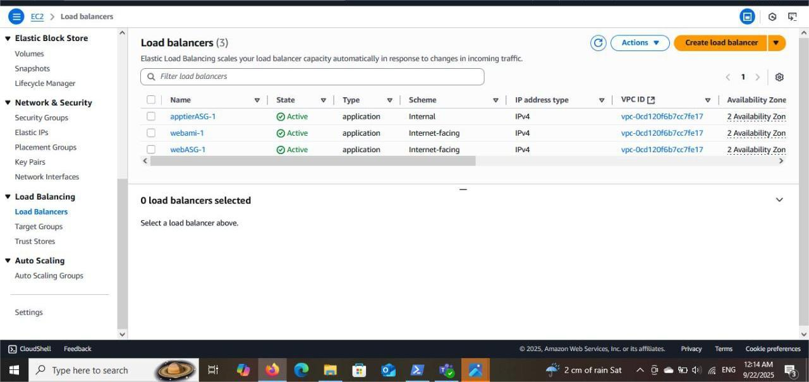

# Three-tier Architecture on AWS

## Introduction

This project uses AWS to build a three-tier web application with separate layers for the web interface, business logic, and database, ensuring security and scalability.

## Architecture Overview

.png)

The three-tier architecture separates responsibilities into distinct layers:

* **Web Tier**: Handles HTTP requests, serves static content, and forwards dynamic requests to the application tier.

* **Application Tier**: Processes business logic and interacts with the database tier.

* **Database Tier**: Manages data storage and retrieval, typically using MySQL.

## Infrastructure Components

### Networking setup

The core of our architecture is a custom VPC, structured with properly segmented public and private subnets for better isolation and security.

.png)

.png)

.png)

.png)

.png)

##  Web Tier Components

#### The Web Tier consists of:
* An **Auto Scaling group** of EC2 instances running web servers

* An **internet-facing Application Load Balancer** to distribute incoming traffic

* A **custom AMI** to ensure consistent and repeatable deployments across instances

.png)

### Application Tier 

#### Application Tier consists of:
* An **Auto Scaling group** of EC2 instances running application servers

* An **internal Application Load Balancer** to distribute requests from the Web Tier

* A **custom AMI** to ensure consistent and reliable deployment of the application code

.png)

.png)

### Database Tier

#### Database Tier consists of:
* A **managed relational database instance** using Amazon RDS (e.g., MySQL)

* **Multi-AZ deployment** enabled for high availability and automatic failover

* **Automated backups**, snapshots, and monitoring for data protection and reliability

.png)

.png)

## Content Delivery and Storage

### For performance and scalability, we implemented:

* **CloudFront distribution** to deliver content faster by caching it globally.

* **Load Balancer** to distribute traffic evenly across multiple web servers that serve both static and dynamic content.

%20(1).png)

.png))

## Implementation Steps

### 1.Network Infrastructure
* Create a **custom VPC** (e.g., mycustomvpc) with CIDR block like 10.0.0.0/16.

* Configure **public and private subnets** across multiple Availability Zones for high availability.

* Set up **route tables** to control traffic flow.

* Deploy a **NAT Gateway** in the public subnet to allow outbound internet access for resources in private subnets (e.g., app servers or database patches).

### 2. Database Tier
* Launch an **Amazon RDS MySQL** instance in **private subnets**.

* Configure **security groups** to allow access only from the Application Tier.

* Database instance is **not publicly accessible**; accessed only through the app tier.

* Set up the database connection details in the application for secure communication.

### 3. Application Tier
* Create a **custom AMI** containing the application code and runtime environment.

* Use a **Launch Template** to define the EC2 instances consistently.

* Deploy an **internal Application Load Balancer (ALB)** to route requests from the Web Tier to the app servers.

* Configure **Auto Scaling** to dynamically add or remove instances based on load.

### 4. Web Tier
* Create a **custom AMI** configured with a web server (Apache, NGINX, etc.).

* Use a **Launch Template** to launch EC2 instances running the web server.

* Set up an **internet-facing Application Load Balancer (ALB)** to distribute incoming user traffic across web instances.

* Enable **Auto Scaling** for web instances to handle fluctuations in user traffic.

## Security Considerations

* Database instances are located in **private subnets** with no direct public access.

* Application Tier is accessible only via the **internal load balancer**.

* Web Tier is exposed to the internet but strictly controlled via security groups and the external ALB.

* Security groups restrict traffic flow only between the intended tiers.

* NAT Gateway manages secure outbound traffic from private subnets.

## Performance Features

* Auto Scaling ensures the infrastructure adapts automatically to traffic changes.

* Load balancers distribute traffic evenly to prevent any single server from becoming a bottleneck.

* Multi-AZ deployment ensures high availability and fault tolerance.

## Usges

* Users send HTTP/HTTPS requests to the Web Tier ALB.

* The Web Tier handles static content and forwards dynamic requests to the Application Tier via the internal ALB.

* The Application Tier processes business logic and interacts with the Database Tier to fetch/store data.

* The Database Tier securely manages persistent data storage.

## Monitoring

* Use Amazon CloudWatch for monitoring instances, load balancers, and RDS metrics.

* Enable logging and alarms to maintain operational visibility and troubleshoot issues quickly.

## Conclusion

This classic 3-tier architecture with load balancers provides a scalable, secure, and highly available setup without relying on S3 for storage. It follows AWS best practices by isolating tiers, using load balancers for traffic distribution, and securing each layer with private networking and security groups.

